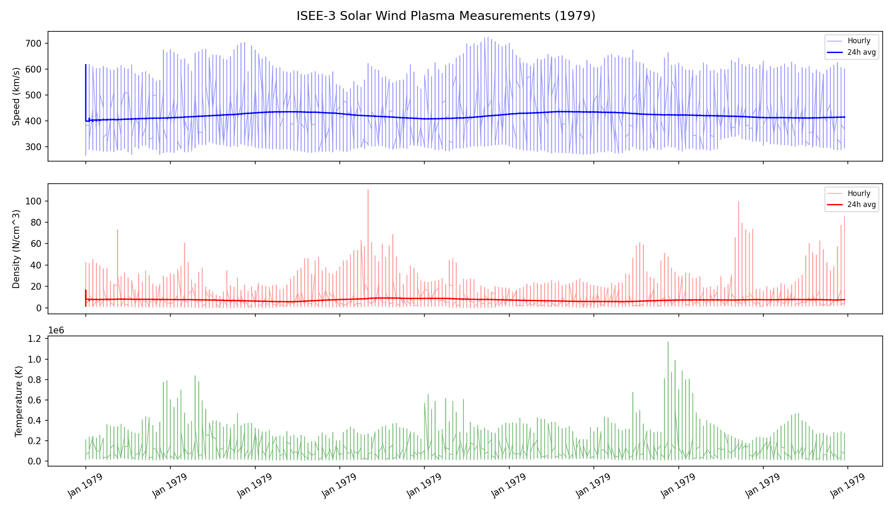
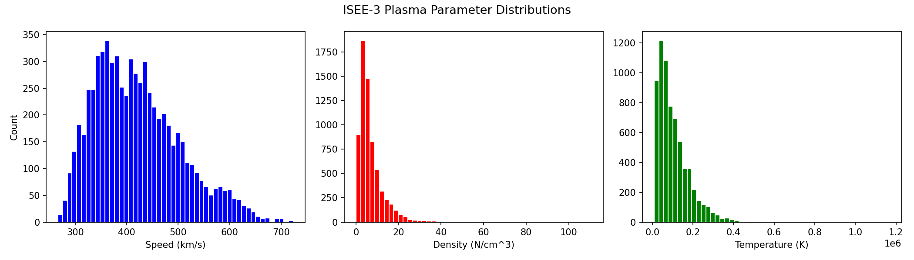
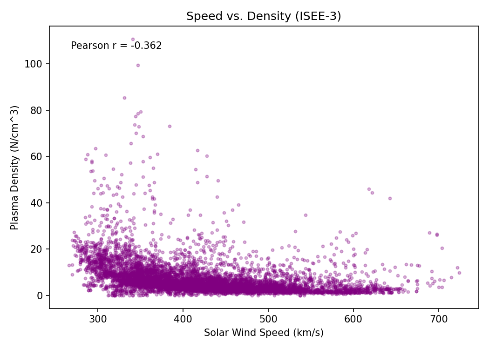
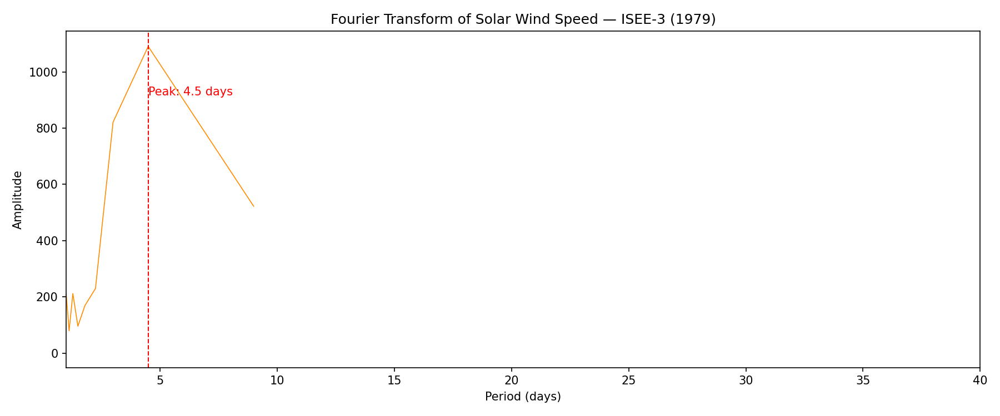

# Solar-Wind-Analysis
Analysis of solar wind plasma measurements from the ISEE-3 spacecraft (1979). The data was sourced from https://omniweb.gsfc.nasa.gov/

The original dataset includes data from the IMP 8/LANL, IMP 8/MIT, and ISEE-3 space instruments. However, only data from the ISEE-3 was used since it had the highest completed data. The data period was 1978-08-13 to 1982-10-12.

The variables analyzed are: 
Solar wind speed (km/s)
Plasma density (N/cm^3)
Plasma temperature (K)

## The Results:

### Time Series with Rolling Average:
Solar wind speeds appears stable around 400km/s thoughout 1979. The density shows spikes probably caused by coronal mass ejections.



### Parameter Distributions:
The solar wind speed is approximately a normal distribution cenetered around 400km/s. 



### Speed-Density Correlation:
A negative correlation (Pearson r = −0.362) exists between speed and plasma density. 



### Fourier Analysis:
A FFT applied to the speed time (resampled), shows a dominant periodicity of near 4.5 days.




## How to Run

```bash
pip install -r requirements.txt
python main.py
```

